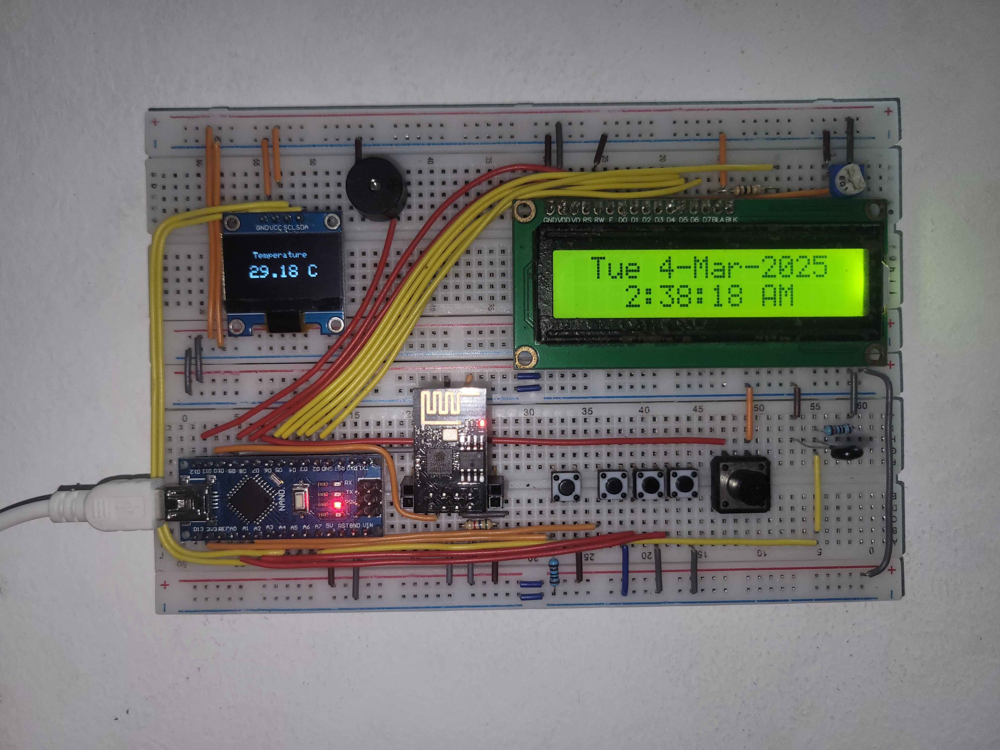

This is the Arduino code for a breadboard project. The project uses an Arduino Nano, an ESP8266, an 0.96" OLED and a 1602 LCD display to show the room temperature collected using a thermistor and time and date. The project also has stopwatch and timer functionality.

# Project Image

